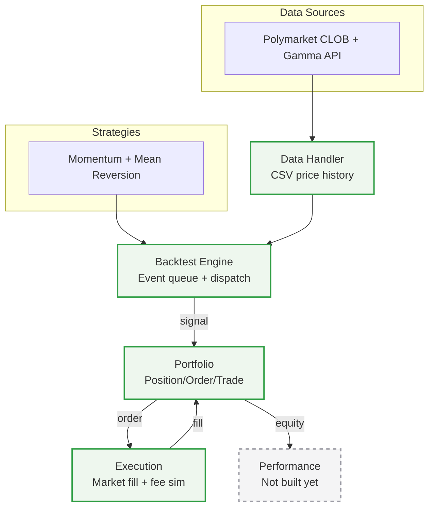

# Backtester pipeline & roadmap

**Legend**: solid green = built and verified. Dashed grey = not built yet.

Verified end-to-end against the real earthquake CSV: 2,313 events processed, 146 trades, cash reconciles exactly against `initial_cash + sum(trade.net_pnl)`.

## Backlog

- Live/continuously-updating data source (currently CSV snapshots only)
- Market resolver ("ask an agent what market to pull") for generalizing beyond one hand-picked market at a time
- Take-profit / stop overlay with a velocity exception (informational vs. noise moves) — also in `backlog.md`
- Slippage in the execution simulator
- Whether `SignalEvent.strength` should scale Portfolio's order quantity — also in `backlog.md`
- SQLite-backed data handler (in place of / alongside CSV)
- LLM-assisted idea generation for strategies/exit rules — also in `backlog.md`
- `portfolio/order.py`'s `Order` class is currently dead code (created/mutated, never read) — either wire it to something or drop it once it's clear whether limit orders are actually coming
- `Strategy.force_close()` relies on every subclass naming its position flag `_in_position` exactly, with no enforcement — fragile if a new strategy subclass doesn't follow the convention
- `Position.update()` silently clamps a close request that exceeds the held quantity, rather than erroring — fine while order sizing is fixed, worth a guard if sizing ever varies
- `RollingZScore(window=1)` would crash (`statistics.stdev` needs ≥2 points) — unreachable today, no validation guard

Regenerate this diagram (or ask Claude to) whenever the pipeline changes — it's plain text, so it's easy to keep in sync rather than letting it drift.
