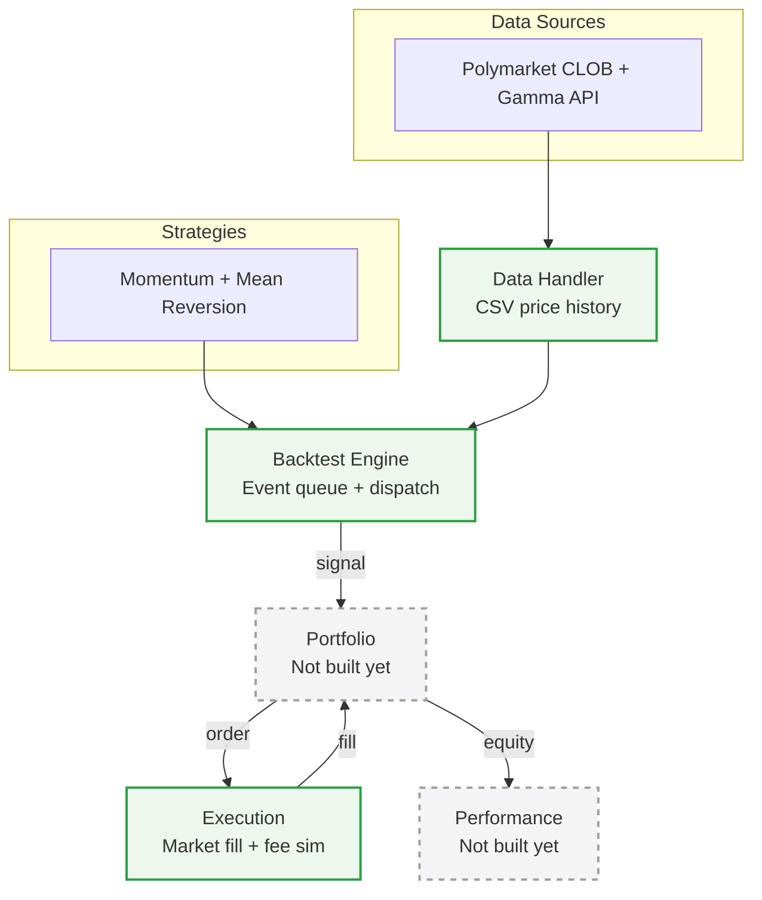

# Backtester pipeline & roadmap

**Legend**: solid green = built and verified. Dashed grey = not built yet.

## Backlog

- Live/continuously-updating data source (currently CSV snapshots only)
- Market resolver ("ask an agent what market to pull") for generalizing beyond one hand-picked market at a time
- Take-profit / stop overlay with a velocity exception (informational vs. noise moves)
- Slippage in the execution simulator
- Whether `SignalEvent.strength` should scale Portfolio's order quantity
- SQLite-backed data handler (in place of / alongside CSV)
- LLM-assisted idea generation for strategies/exit rules

Regenerate this diagram (or ask Claude to) whenever the pipeline changes — it's plain text, so it's easy to keep in sync rather than letting it drift.
